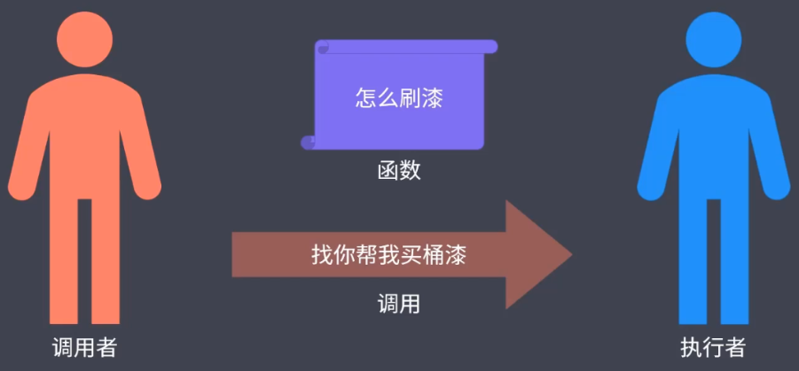

# 回调函数

> 所有异步编程方案的根基：**由调用者定义，交给执行者执行的函数。**

**JavaScript 实现异步编程的根本方式**

其实所有的异步编程方案，其根本都是 *回调函数*，***回调函数* 可以理解为一件你想要做的事情**。

> 你明确知道一件事儿如何一步一步的往下做，但是你并不知道这件事情所依赖的任务何时完成，所以最好的办法就是把这件事儿的步骤写到一个函数中，交给任务的执行者，这个异步任务执行者知道这个任务何时结束，在结束之后帮你执行你想要做的事情，这个想要做的事情就可以理解为 *回调函数*。

