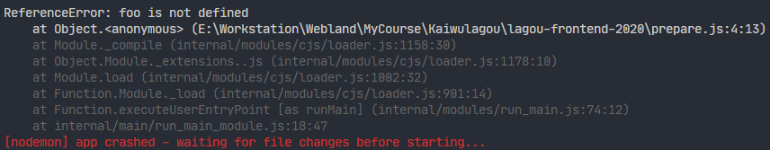

# let 与块级作用域

> 作用域 —— 某个成员能够起作用的范围

在此之前，ES 中只有 2 种作用域：

- 全局作用域
- 函数作用域
- 块级作用域（ES 2015 新增）

**块** —— 代码中用 `{}` 所包裹起来的范围，例如：

```js
if (true) {
  console.log('Darwin')
}

for (var i = 0; i < 10; i++) {
  console.log('Darwin')
}
```

以前块没有独立的作用域

```js
if (true) {
  var foo = 'Darwin'
}
console.log(foo)
// -> Darwin
```

有了 *块级作用域* 之后，通过关键词 —— let，来声明变量，只能在声明的代码块中被访问。

```js
if (true) {
  let foo = 'Darwin'
}
console.log(foo)
```

控制台报错：



块级作用域使用实例：

```js
var elements = [{}, {}, {}]
for (let i = 0; i < elements.length; i++) {
  elements[i].onclick = function () {
    console.log(i);
  };
}
elements[1].onclick(); //-> 1

```

等价于：

```js
var elements = [{}, {}, {}]
for (var i = 0; i < elements.length; i++) {
  elements[i].onclick = (function () {
    return function () {
      console.log(i);
    }
  }(i));
}

```

在 for 循环内实际有 2 层作用域：

```js
for (let i = 0; i < 3; i++) {
  let i = 'foo'
  console.log(i)
}
```

输出：

```
foo
foo
foo
```

拆解 for 循环：

```js
for (...) {
  let i = 0;
  if (i < 3) {
    let i = 'foo';
    console.log(i);
  }
  i++;
}
```

