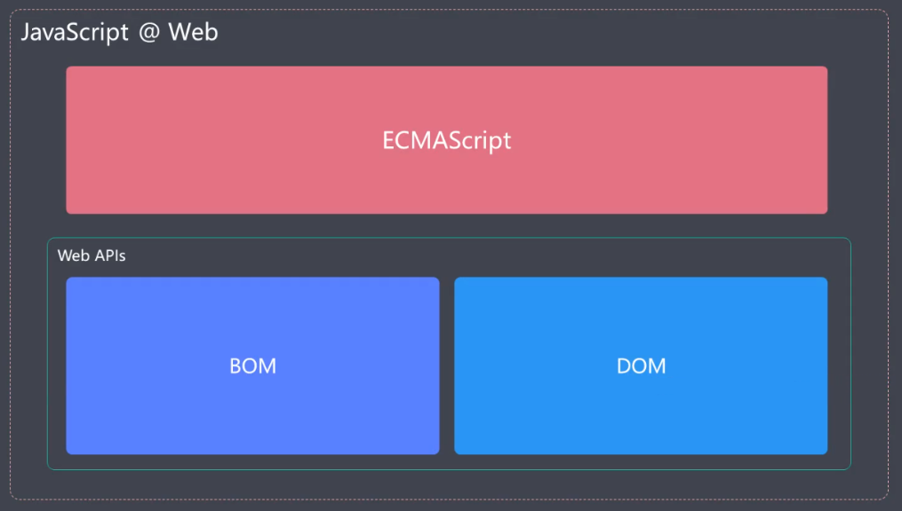
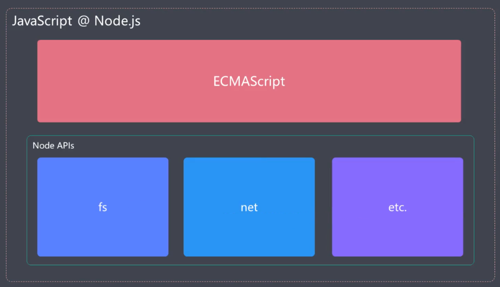
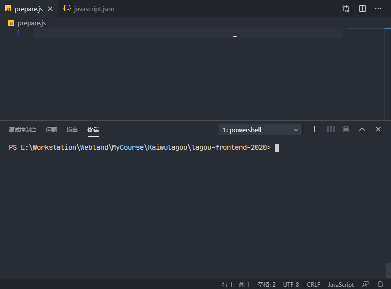

# ECMAScript 概述

通常看做 JavaScript 的标准化规范，但实际上 JavaScript 是 ECMAScript 的扩展语言。因为在 ECMAScript 中只提供了最基本的语法。JavaScript 实现了 ECMAScript 语言的标准，并且在此基础之上做了扩展。





JavaScript 语言本身指的就是 ECMAScript，从 2015 年开始 ES 保持每年一个版本的迭代：


> ES5 之后，ECMAScript 开始按照年份命名。很多人也把 ES2015 称之为 ES6

# ECMAScript 2015

[ECMAScript® 2015 Language Specification](http://ecma-international.org/ecma-262/6.0/)

> 即 ES6，最新 ECMAScript 标准的代表版本

- 相比于 ES5.1 的变化比较大
- 自此，标准命名规则发生变化，更准确的缩写名称：ES 2015

有些开发者喜欢用 ES6 泛指 ES 5.1 之后的所有的新标准。例如，“使用 ES6 的  async 和 await”，实际上 async 函数是 ES 2017 中指定的标准。

ES 5.1 基础之上的变化：

- 解决原有语法上的一些问题或不足
- 对原有语法进行增强
- 全新的对象、全新的方法、全新的功能
- 全新的数据类型和数据结构

## 运行环境

选择 Node.js 环境去做具体的尝试

> [Node.js ES2015 Support](https://node.green/#ES2015)

安装 Nodemon：https://www.npmjs.com/package/nodemon

作用：修改完代码后自动执行代码

```sh
$ npm i nodemon --save-dev
```

运行：

```sh
$ npx nodemon .\prepare.js
```

