# Promise 概述

> 一种更优的异步编程统一方案

回调函数 是 JavaScript 中所有异步编程方式的根基，直接使用传统回调的方式去完成复杂的异步流程，就无法避免大量的回调函数嵌套。为了避免这种问题，CommonJS 社区提出了 Promise 的规范，并在 ES2015 中被标准化，成为语言规范。

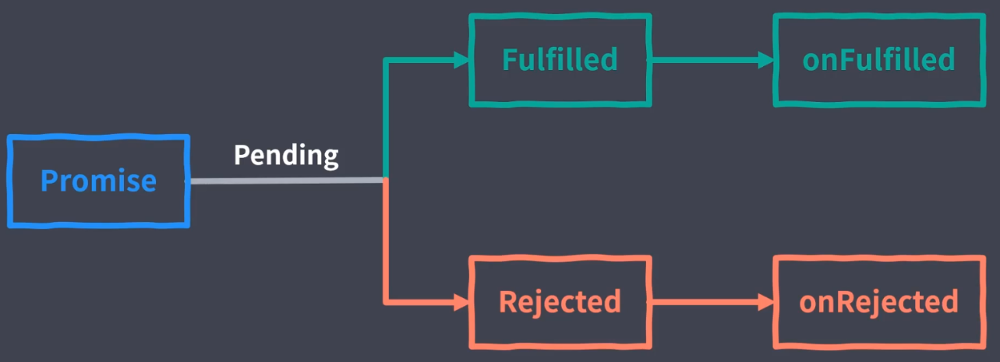

# Promise 基本用法

环境配置：

- *package.json*

  ```json
  {
    "devDependencies": {
      "html-webpack-plugin": "^4.3.0",
      "webpack": "^4.43.0",
      "webpack-cli": "^3.3.12",
      "webpack-dev-server": "^3.11.0"
    }
  }
  ```

- *webpack.config.js*

  ```js
  const HtmlWepackPlugin = require('html-webpack-plugin')
  
  module.exports = {
    mode: 'none',
    stats: 'none',
    devtool: 'source-map',
    plugins: [new HtmlWepackPlugin()]
  }
  ```

*promise.js*

```js
// Promise 基本实例

const promise = new Promise((resolve, reject) => {

  // 这里用于“兑现”承诺
  // resolve(100);

  // “承若”失败
  reject(new Error('Promise rejected'));
});

promise.then(
  (value) => console.log('resolve', value),
  (error) => console.log('reject', error),
);

console.log('END');

```

运行结果：

```
END
promise.js:14 reject Error: Promise rejected
    at promise.js:9
    at new Promise (<anonymous>)
    at Object.<anonymous> (promise.js:3)
    at __webpack_require__ (bootstrap:19)
    at Object.<anonymous> (bootstrap:83)
    at __webpack_require__ (bootstrap:19)
    at bootstrap:83
    at bootstrap:83
```

# Promise 使用案例

*promise-ajax.js*

```js
// Promise 方式的 AJAX

function ajax(url) {

  return new Promise(function(resolve, reject) {
    const xhr = new XMLHttpRequest();
    xhr.open('GET', url);
    xhr.responseText = 'json';
    xhr.onload = function() {
      if (this.status === 200) {
        resolve(this.response);
      } else {
        reject(new Error(this.statusText));
      }
    }
    xhr.send();
  })
}

ajax('/api/users.json').then(
  function (response) { console.log(response); },
  function (error) { console.error(error); }
)
```

运行：

```sh
npx webpack-dev-server .\promise-ajax.js --open
```

结果：

```
[
  {
    "name": "Darwin",
    "age": 30
  },
  {
    "name": "Newton",
    "age": 32
  }
]
```

# Promise 常见误区

从表象上看 Promise 的本质也是使用回调函数去定义异步任务结束后所需执行的任务。但回调函数嵌套使用的方式是使用 Promise 最常见的错误。正确的做法是，借助于 Promise then 方法链式调用的特点，尽量保证异步任务的扁平化。

```js
// 嵌套使用 Promise 是最常见的误区
ajax('/api/urls.json').then(function (urls) {
  ajax(urls.users).then(function (users) {
    ajax(urls.users).then(function (users) {
      ajax(urls.users).then(function (users) {
        ajax(urls.users).then(function (users) {
				// ...
        })
      })
    })
  })
});
```

# Promise 状态

Promise 对象有 3 个状态：

- pending
- fulfilled
- rejected

MDN 文档上对 Promise 对象状态变化过程用一副图描述：


图中有几个小细节：

1. *fulfilled* 和 *rejected* 表示指向不同结果，而不是指一个过程，在到达 `fulfilled`、`rejected` 状态前 promise 都处于 `pending` 状态。
2. *settled* 包括：`fulfilled`、`rejected` 。
3. promise 只会在 `pending`、`fulfilled`、`rejected`  3 种状态下切换。

## States and Fates

文章 [promises-unwrapping](https://github.com/domenic/promises-unwrapping)/[docs](https://github.com/domenic/promises-unwrapping/tree/master/docs)/[**states-and-fates.md**](https://github.com/domenic/promises-unwrapping/blob/master/docs/states-and-fates.md) 将 Promise 分得更细，分为：

- state：状态
- fates：命运

### State

状态（state）就是前面提到的 3 种状态：`pending`、`fulfilled`、`rejected`  。

> 需要留意的是，前面提到的 *settled*  不是一种 Promise 状态，只是一种语义上的便利，描述 Promise 已经确定。

### Fates

命运（fates）分为 `resolved` 和 `unresolved`，两种命运互斥。

- `resolved`，原文为：

  > A promise is *resolved* if trying to resolve or reject it has no effect, i.e. the promise has been "locked in" to either follow another promise, or has been fulfilled or rejected.

  解释为：当没有办法去 resolve 或 reject 一个 promise 的时候，这个 promise 就是 `resolved` 的。

- `unresolved`，原文为：

  >A promise is *unresolved* if it is not resolved, i.e. if trying to resolve or reject it will have an impact on the promise.

  解释为：非 `resolved` 的 promise。

显而易见，只要理解了 `resolved` 的描述，自然就理解 `unresolved`。

首先，提出一个 Promise 的概念，当 Promise 的状态一旦改变，就永久保持该状态。所以，什么时候没办法去 resolve 或 reject 一个 promis 对象呢？

1. 处于 `fulfilled` 和 `rejected` 状态的 promise 对象，因为他们已经无法改变状态，而 resolve 和 reject 只能对 `pending` 状态的 promise 有效。
2. 处于 `pending` 状态的 promise 对象也可能处于 `resolved`，
   - 当 promise 对象被 “锁定” 在另外一个 promise 对象
   - 或者 一个非即使返回的 `thenable` 函数中时，例如：promiseA 被 resolve 为 promiseB。

### 代码示例

#### Promise 的 3 种状态

在浏览器打印 promise 对象时，`[[PromiseStatus]]` 有 3 个值：`pending`、`fulfilled`、`rejected`，这里 `fulfilled` 状态在不同的浏览器显示稍有不同，在 Chrome 浏览器中该值显示为 `resolved`，并且此值和前面提到的 Fates 中的 `resolved` 没有任何关系。

*promise-state.js*

```js
// Promise State pending //
const promise = new Promise((resolve, reject) => [
]);

console.log(promise);
```

 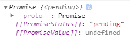

```js
// Promise State fulfilled //
const promise = new Promise((resolve, reject) => {
  resolve();
});

console.log(promise);
```

 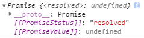

 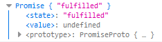

```js
// Promise State rejected //
const promise = new Promise((resolve, reject) => {
  reject();
});

console.log(promise);
```

 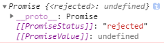

#### 一个简单的代码

*promise-state.js*

```js
// Promise Simple Code //

const promise = new Promise((resolve, reject) => {
  setTimeout(resolve, 1000, 'promise resolve');
});
promise.then((value) => {
  console.log(value);
  console.log(promise);
});
```

 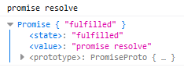

很简单，1秒后打印 `promise resolve`，promise 对象状态为 `fulfilled`。

#### 嵌套 Promise

> A promise can be "resolved to" either a promise or thenable, in which case it will store the promise or thenable for later unwrapping; or it can be resolved to a non-promise value, in which case it is fulfilled with that value.
>
> 一个 promise 可以被 resolved 到 一个 promise 或者 thenable，这种情况下将保存这个 promise 或 thenable 的状态之后分开依次执行；或者还可以被 resolved 到 一个 非 promise 的值，这种情况 promise 将以 `fulfilled` 状态执行该值。

*promise-state.js*

```js
// Promise Nested //

const promise = new Promise((resolve, reject) => {
  const nestCallback = () => {
    /* 
    resolve(new Promise((resolve, reject) => {
      console.log(promise);
      setTimeout(resolve, 2000, 'new promise resolve');
    }));
    */
    resolve({
      then: (resolve, reject) => {
        console.log(promise);
        setTimeout(resolve, 2000, 'new promise resolve');
      }
    });
  };
  setTimeout(nestCallback, 100, 'promise resolve');
});
promise.then((value) => {
  console.log(value);
  console.log(promise);
});
```

 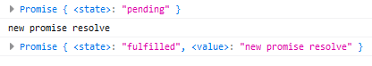

运行一下，1秒后打印

```
Promise { <state>: "pending" }
```

3秒后打印

```
new promise resolve
Promise { <state>: "fulfilled", <value>: "new promise resolve" }
```

可以看到，1秒后 promise 调用了 resolve 方法，和上一个例子一样被 resolve 了，理应变为 `fulfilled` 状态，但是其被 “锁定” 在了一个新的 Promise 对象中，所以状态没有立刻改变并执行 `onfulfilled` 方法，而是依然处于 `pending` 状态，但是很明显的是，最终结果就是 `fulfilled` 状态，此时 promise 不能再 resolve 或 reject。

再过 2秒后新 Promise 对象 resolve，promise 执行 `then()` ，状态变为 `fulfilled`，打印的值也变为 `new Promise resolve`，而不是 `promise resolve`。此时打印的 promise 的状态就是 `fulfilled`。

由此可以看出，处于 `pending` 状态的 Promise 对象也有可能处于 `resolved` 命运就很清楚了，至于 `unresolved`，就是 Promise 可以被 resol 或 reject 的时候，此时 Promise 对象一定处于 `pending` 状态且没有被 resolve 或 reject 为其他 Promise 对象 或 非即时返回的 `thenable` 函数。反过来，处于 `pending` 状态的 Promise 对象不一定是 `unresolved` 的。

# Promise 嵌套调用

以下代码主要讨论 `resolve(Promise.resolve())` 内部执行了什么？先说结论：

```js
const thenable = new Promise()
resolve(thenable);
```

等价于

```js
const thenable = new Promise()
new Promise((_resolve, _reject) => {
  thenable.then(_resolve, _reject);
}).then(resolve);
```

在代码运行时会产生延时效果：

```js
const thenable = new Promise()
new Promise((_resolve, _reject) => {
  thenable
    .then(_resolve, _reject); // 第2次延时
})
.then(resolve); // 第1次延时
```

## Promise in Typescript

*PromiseConstructor*

```typescript
interface PromiseConstructor {
    /**
     * A reference to the prototype.
     */
    readonly prototype: Promise<any>;

    /**
     * Creates a new Promise.
     * @param executor A callback used to initialize the promise. This callback is passed two arguments:
     * a resolve callback used to resolve the promise with a value or the result of another promise,
     * and a reject callback used to reject the promise with a provided reason or error.
     */
    new <T>(
      executor: (
       resolve: (value?: T | PromiseLike<T>) => void, 
       reject: (reason?: any) => void
      ) => void
    )
    : Promise<T>;
}
```

*Promise*

```typescript
interface Promise<T> {
    /**
     * Attaches callbacks for the resolution and/or rejection of the Promise.
     * @param onfulfilled The callback to execute when the Promise is resolved.
     * @param onrejected The callback to execute when the Promise is rejected.
     * @returns A Promise for the completion of which ever callback is executed.
     */
    then<TResult1 = T, TResult2 = never>(
      onfulfilled?: ((value: T) => TResult1 | PromiseLike<TResult1>) | undefined | null, 
      onrejected?: ((reason: any) => TResult2 | PromiseLike<TResult2>) | undefined | null
    )
    : Promise<TResult1 | TResult2>;

    /**
     * Attaches a callback for only the rejection of the Promise.
     * @param onrejected The callback to execute when the Promise is rejected.
     * @returns A Promise for the completion of the callback.
     */
    catch<TResult = never>(
      onrejected?: 
        ((reason: any) => TResult | PromiseLike<TResult>) | undefined | null
    )
    : Promise<T | TResult>;
}
```

*PromiseLike*

> 即 `thenable`，带 `then` 方法的对象。

```typescript
interface PromiseLike<T> {
  /**
   * Attaches callbacks for the resolution and/or rejection of the Promise.
   * @param onfulfilled The callback to execute when the Promise is resolved.
   * @param onrejected The callback to execute when the Promise is rejected.
   * @returns A Promise for the completion of which ever callback is executed.
   */
  then<TResult1 = T, TResult2 = never>(
    onfulfilled?: ((value: T) => TResult1 | PromiseLike<TResult1>) | undefined | null, 
    onrejected?: ((reason: any) => TResult2 | PromiseLike<TResult2>) | undefined | null
  )
  : PromiseLike<TResult1 | TResult2>;
}
```

## 代码示例

*promise-nesting.js*

```js
// resolve(Promise.resolve()) //

new Promise((resolve, reject) => {
  console.log('promiseA start');
  resolve(Promise.resolve());
}).then(() => {
  console.log('promiseA - 1');
}).then(() => {
  console.log('promiseA - 2');
}).then(() => {
  console.log('promiseA - 3');
}).then(() => {
  console.log('promiseA - 4');
}).then(() => {
  console.log('promiseA - 5');
});

new Promise((resolve) => {
  console.log('promiseB start');
  resolve();
}).then(() => {
  console.log('promiseB - 1');
}).then(() => {
  console.log('promiseB - 2');
}).then(() => {
  console.log('promiseB - 3');
}).then(() => {
  console.log('promiseB - 4');
}).then(() => {
  console.log('promiseB - 5');
});
```

结果：

```
promiseA start
promiseB start
promiseB - 1
promiseB - 2
promiseA - 1
promiseB - 3
promiseA - 2
promiseB - 4
promiseA - 3
promiseB - 5
promiseA - 4
promiseA - 5
```

等同于：*promise-nesting.js*

```js
// resolve(Promise.resolve()) //
new Promise((resolve, reject) => {
  console.log('promiseA start');
  // resolve(Promise.resolve());
  const thenable = Promise.resolve();
  new Promise((_resolve, _reject) => {
    thenable.then(_resolve, _reject);
  }).then(resolve);
}).then(() => {
  console.log('promiseA - 1');
}).then(() => {
  console.log('promiseA - 2');
}).then(() => {
  console.log('promiseA - 3');
}).then(() => {
  console.log('promiseA - 4');
}).then(() => {
  console.log('promiseA - 5');
});

new Promise((resolve) => {
  console.log('promiseB start');
  resolve();
}).then(() => {
  console.log('promiseB - 1');
}).then(() => {
  console.log('promiseB - 2');
}).then(() => {
  console.log('promiseB - 3');
}).then(() => {
  console.log('promiseB - 4');
}).then(() => {
  console.log('promiseB - 5');
});
```

# Promise 链式调用

- Promise 对象的 then 方法会返回一个全新的 Promise 对象
- 后面的 then 方法就是为上一个 then 返回的 Promise 注册回调
- 前面的 then 方法中回调函数的返回值会作为后面 then 方法回调的参数
- 如果回调中返回的是 Promise，后面 then 方法的回调会等待这个 Promise 的结束

*promise-chaining.js*

```js
// Promise 链式调用

function ajax(url) {

  return new Promise(function(resolve, reject) {
    const xhr = new XMLHttpRequest();
    xhr.open('GET', url);
    xhr.responseText = 'json';
    xhr.onload = function() {
      if (this.status === 200) {
        // resolve 在异步调用中 所以是 pending
        resolve(this.response);
      } else {
        reject(new Error(this.statusText));
      }
    }
    xhr.send();
  });
}

const promise = ajax('/api/users.json');

const promise1 = promise.then(
  function onFulfilled(response) {
    console.log('onFulfilled', response);
    return ajax('/api/urls.json');
  },
  function onRejected(error) {
    console.warn('onRejected', error);
  }
);

console.log(promise1);
console.log(promise1 === promise);


ajax('/api/users.json')
  .then((value) => {
    console.log(11111)
    return ajax('/api/urls.json')
  })// => Promise
  .then((value) => {
    console.log(22222)
    console.log(value)
  })// => Promise
  .then((value) => {
    console.log(33333)
  })// => Promise
  .then((value) => {
    console.log(44444)
    return 'foo'
  })// => Promise
  .then((value) => {
    console.log(55555)
    console.log(value)
  })

```

 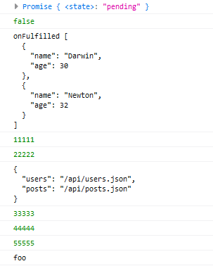

# Promise 异常处理

*promise-exception-handling.js*

```js
// Promise 异常处理

function ajax(url) {

  return new Promise(function(resolve, reject) {
    // foo();
    throw new Error('Promise Error');
    const xhr = new XMLHttpRequest();
    xhr.open('GET', url);
    xhr.responseText = 'json';
    xhr.onload = function() {
      if (this.status === 200) {
        resolve(this.response);
      } else {
        reject(new Error(this.statusText));
      }
    }
    xhr.send();
  });
}


const promise = ajax('/api/users.json')
  .then(
    function onFulfilled(value) {
      console.log('onFulfilled', value);
    },
    function onRejected(error) {
      console.warn('onRejected', error);
    }
  );
console.log(promise)

```

 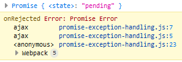

还可以使用 `catch()` 方法捕获异常，实际上是 `catch()` 是给前面的 then 方法返回的 Promise 指定失败的回调，并不是第一个 Promise 对象指定。但由于，同出同一个 Promise 链条，前面 Promise 上的异常会一直被往后传递，所以才能捕获；而通过 then 方法第二个参的异常回调，仅仅只能捕获第一个 Promise 的异常：

```js
ajax('/api/users.json')
  .then(
    function onFulfilled(value) {
      console.log('onFulfilled', value);
      return ajax('/api/urls1.json');
    },
    function onRejected(error) {
      console.warn('onRejected', error);
    }
  );

// 使用 catch 方法捕获异常
ajax('/api/users.json')
  .then(function(value) {
    console.log(value)
    return ajax('/api/user11.json')
  })// => Promise
  .catch(function(error) { console.warn(error) })
```

 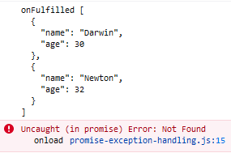

 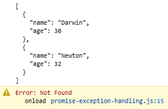

## unhandledrejection

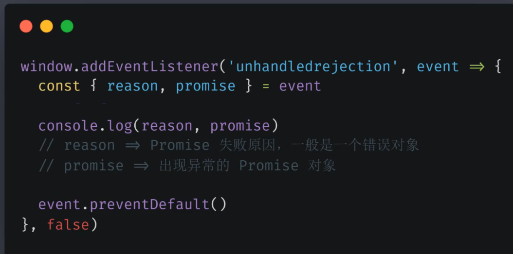

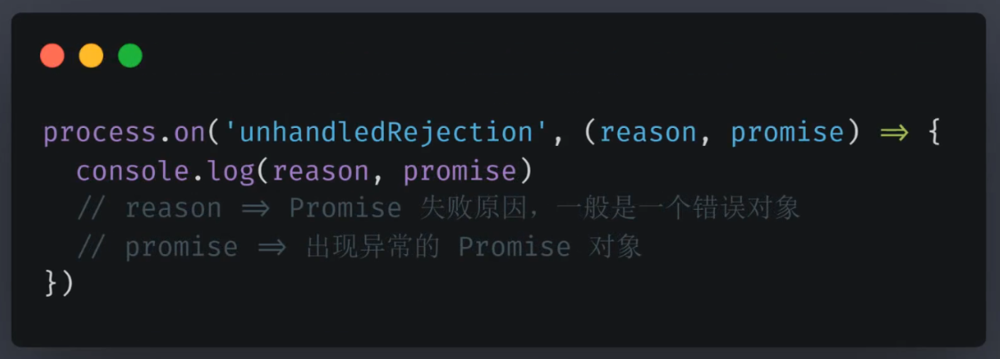

# Promise 静态方法

## Promise.resolve()

`Promise.resolve()` 参数接收一个 Promise 对象的话，会原样返回：

*promise-static-method.js*

```js
const promise1 = ajax('/api/users.json')
const promise2 = Promise.resolve(promise1)

console.log(promise1 === promise2)
```

结果：

```
true
```

`Promise.resolve()` 参数可以接收 thenable 接口对象：

*promise-static-method.js*

```js
Promise.resolve({
  then: function(onFulfilled, onRejected) {
    onFulfilled('On')
  }
}).then((value) => { console.log(value) })
```

结果：

```
On
```

## Promise.reject()

*promise-static-method.js*

```js
Promise.reject(new Error('reject'))
  .catch((error) => console.warn(error))
```

# Promise 并行执行

## Promise.all()

*promise-all.js*

```js
// Promise 并行执行 //

function ajax(url) {

  return new Promise(function(resolve, reject) {
    const xhr = new XMLHttpRequest();
    xhr.open('GET', url);
    xhr.responseText = 'json';
    xhr.onload = function() {
      if (this.status === 200) {
        // resolve 在异步调用中 所以是 pending
        resolve(this.response);
      } else {
        reject(new Error(this.statusText));
      }
    }
    xhr.send();
  });
}


const promise = Promise.all([
  ajax('/api/users.json'),
  ajax('/api/urls.json')
]);

promise.then(function(values) {
  console.log(JSON.parse(values[0]));
  console.log(JSON.parse(values[1]));
})
```

 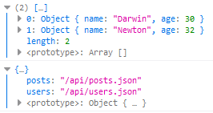

有任何一个 Promise 失败就整体就会以失败结束：

*promise-all.js*

```js
const promise = Promise.all([
  ajax('/api/users.json'),
  ajax('/api/urls11.json')
]);

promise.then(function(values) {
  console.log(JSON.parse(values[0]));
  console.log(JSON.parse(values[1]));
}).catch((error) => console.warn(error));
```

 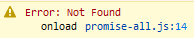

```js
ajax('/api/urls.json')
  .then(value => {
    const urls = Object.values(eval('(' + value + ')'))
    const tasks = urls.map(url => ajax(url))
    return Promise.all(tasks)
  })
  .then(values => {
    // console.log(eval('[(' + values + ')]'))
    console.log(values.map(value => JSON.parse(value)))
  })
```

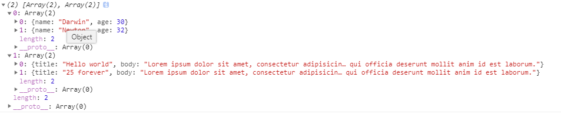

## Promise.race()

Promise.all() 是等待所有任务结束，Promise.race() 只会等待第一个结束的任务（即只要有一个任务完成就相应）：

*promise-all.js*

```js
const request = ajax('/api/posts.json')
const timeout = new Promise((resolve, reject) => {
  setTimeout(() => reject(new Error('timeout')), 500)
})

// 500 毫秒内返回请求相应，之后相应不返回
Promise.race([request, timeout])
  .then(value => console.log(value))
```

使用 Network 网络限速

 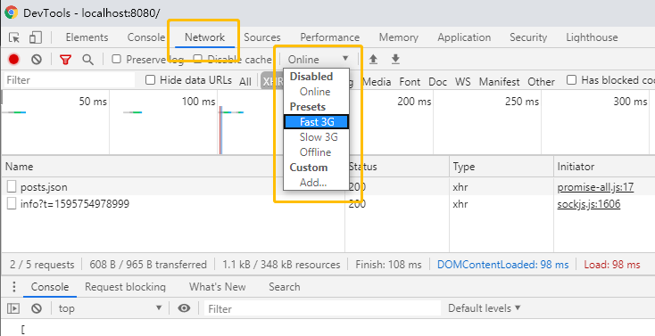

# Promise 执行时序

宏任务 VS 微任务

回调队列中的任务称之为「宏任务」，宏任务执行过程中可以临时加上一些额外的需求。对于这些临时额外的需求，可以选择作为一个新的宏任务进到队列中排队。也可以作为当前任务的「微任务」，直接在当前任务结束过后立即执行。Promise 的回调会作为微任务执行！

Promise & MutationObserver & process.nextTick

# 参考资料

- [ES6 Promise的resolved深入理解](https://www.cnblogs.com/JuFoFu/p/6692055.html)
- [Promise源码分析（附带Promise的正确打开方式）](https://blog.csdn.net/Newbie___/article/details/107138825)
- [The Modern JavaScript Tutorial](https://javascript.info/)
- [Tasks, microtasks, queues and schedules](https://jakearchibald.com/2015/tasks-microtasks-queues-and-schedules/)
- [promise 实现（es6 完整源码）](http://www.fly63.com/article/detial/2738)
- [《JavaScript with promises》简要笔记](https://www.zybuluo.com/frank-shaw/note/489730)
- [promise源码解析](https://www.shuzhiduo.com/A/RnJWLAlR5q/)
- [深入理解Promise运行原理](https://juejin.im/post/5a5ea6f56fb9a01cbf385e62)
- [Promise的源码实现（完美符合Promise/A+规范）](https://www.cnblogs.com/zhouyangla/p/10781697.html)
- [promise源码解析](https://www.cnblogs.com/cczlovexw/p/10448767.html)
- [promise resolve嵌套promise](https://www.jianshu.com/p/a61f6745b950)
- [Promise.resolve的参数是thenable对象时](https://segmentfault.com/q/1010000017801324)
- [promise笔记之thenable 对象](https://blog.csdn.net/weixin_33753845/article/details/91478557)
- [Promise.resolve的参数是thenable时为什么不调用后面的then?](https://segmentfault.com/q/1010000017888567)
- [如何理解 resolve(Promise.resolve())内部执行了什么](https://segmentfault.com/q/1010000016913023)
- [js 事件循环中的job queue和message queue](https://segmentfault.com/a/1190000016923185)
- [理解promise--一个问题引发的思考](https://segmentfault.com/a/1190000016935513)
- [promise笔记之thenable 对象](https://blog.csdn.net/weixin_33753845/article/details/91478557)
- [Promise.resolve的参数是thenable对象时](https://segmentfault.com/q/1010000017801324)
- [Promise-Polyfill源码解析（1）](https://www.jianshu.com/p/dc98103a1e04)
- [这一次，彻底弄懂 Promise 原理](https://juejin.im/post/5d6f7c83e51d4561c541a712)
- [window.setImmediate](https://developer.mozilla.org/zh-CN/docs/Web/API/Window/setImmediate)
- [setImmediate](https://www.jianshu.com/p/d207df1ca19e)


https://gitee.com/lagoufed/fed-e-002/tree/master/codes/01-01-02-01-asynchronous

https://www.codota.com/
