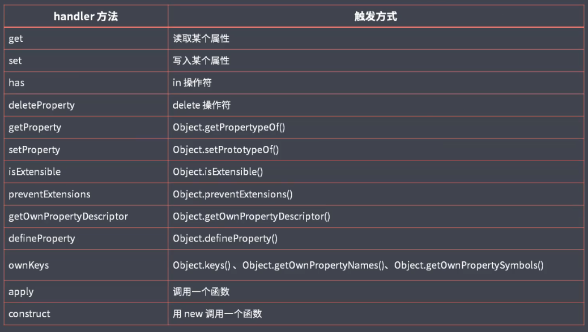

# Proxy

> 代理对象

如果想要监视某个对象的读写，可以使用 ES5 的 Object.defineProperty 方法对对象添加属性，来捕获对象的读写过程。在 ES2015 可以使用 Proxy 来实现。

```js
const person = {
  name: 'Darwin',
  age: 20
};

const personProxy = new Proxy(person, {
  get(target, property) {
    console.log(target, property);
    return property in target ? target[property] : 'default';
  },
  set(target, property, value) {
    if (property === 'age') {
      if (!Number.isInteger(value)) {
        throw new TypeError(`${value} is not an int`);
      }
    }
    target[property] = value;
    console.log(target, property, value);
  }
});

console.log(personProxy.name);
console.log(personProxy.title);

personProxy.gender = true;
personProxy.age = 100;
personProxy.age = '10';


// -> { name: 'Darwin', age: 20 } name
// -> Darwin
// -> { name: 'Darwin', age: 20 } title
// -> default
// -> { name: 'Darwin', age: 20, gender: true } gender true
// -> { name: 'Darwin', age: 100, gender: true } age 100
// -> E:\Workstation\Webland\MyCourse\Kaiwulagou\lagou-frontend-2020\prepare.js:14
// ->         throw new TypeError(`${value} is not an int`);
// ->         ^
// -> 
// -> TypeError: 10 is not an int
```

# Proxy vs Object.defineProperty()

> Proxy 是以非侵入的方式监管了对象的读写

```js
const person = {};

Object.defineProperty(person, 'name', {
  get() {
    console.log('name get()');
    return person._name;
  },
  set(value) {
    console.log('name set()');
    person._name = value;
  }
});

Object.defineProperty(person, 'age', {
  get() {
    console.log('age get()');
    return person._age;
  },
  set(value) {
    console.log('age set()');
    person._age = value;
  }
});

person.age = 'Darwin';
console.log(person.age, person);

// -> age set()
// -> age get()
// -> Darwin { _age: 'Darwin' }
```

## Proxy 能够监视到更多对象操作

defineProperty 只能监视属性的读写



```js
const person = {
  name: 'Darwin',
  age: 20
};

const personProxy = new Proxy(person, {

  deleteProperty(target, property) {
    console.log('delete', property);
    delete target[property];
  }
});

delete personProxy.age;
console.log(person);

// -> delete age
// -> { name: 'Darwin' }
```

## Proxy 更好的支持数组对象的监视

重写数组的操作方法

```js
const list = [];
const listProxy = new Proxy(list, {
  set(target, property, value) {
    console.log('set', property, value);
    target[property] = value;
    return true; // 表示设置成功
  }
});

listProxy.push(100);
listProxy.push(99);


// -> set 0 100
// -> set length 1
// -> set 1 99
// -> set length 2
```


