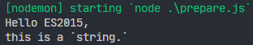

# 模板字符串字面量

支持多行字符串：

```js
const str = `Hello ES2015, 
this is a \`string.\``;
console.log(str);

```

 

插值表达式：

```js
const str = `Hello ES2015, 
this is a \`string.\``;
console.log(str);

const name = 'Darwin';
const msg = `Hey, ${name} —— ${1 + 2} —— ${Math.random()}`;
console.log(msg);

// -> Hey, Darwin —— 3 —— 0.02066608045440055
```

# 模板字符串标签函数

> Tagged templates

```js
// 带标签的模板字符串
console.log`Hello World`;

// -> [ 'Hello World' ]


const _name = 'Turing';
const _gender = true;

function myTagFunc(strings) {
  console.log(strings);
}

const result = myTagFunc`Hey, ${_name} is a ${_gender}.`;

// -> [ 'Hey, ', ' is a ', '.' ]


const _name = 'Turing';
const _gender = true;

function myTagFunc(strings, name, gender) {
  console.log(strings, name, gender);
  return 'VALUE';
}

const result = myTagFunc`Hey, ${_name} is a ${_gender}.`;
console.log(result);

// -> [ 'Hey, ', ' is a ', '.' ] Turing true
// -> VALUE


const _name = 'Turing';
const _gender = true;

function myTagFunc(strings, name, gender) {
  const sex = gender ? 'man': 'woman';
  return strings[0] + name + strings[1] + sex + strings[2];
}

const result = myTagFunc`Hey, ${_name} is a ${_gender}.`;
console.log(result);

// -> Hey, Turing is a man.
```

