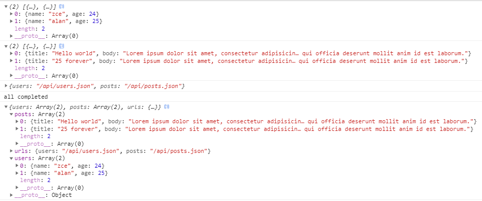

# Async / Await 语法糖

语言层面的异步编程标准

## Generator

```js
function * main() {
  try {
    const users = yield ajax('/api/users.json')
    console.log(users)
    
    const posts = yield ajax('/api/posts.json')
    console.log(posts)
  
    const urls = yield ajax('/api/urls11.json')
    console.log(urls)  
  } catch (error) {
    console.log(error);
  }
}

function handleResult(result) {
  if (result.done) return
  result.value.then(data => {
    handleResult(g.next(data))
  }, error => {
    g.throw(error)
  })
}

const g = main()
handleResult(g.next())
```

## Async / Await

```js
// Async / Await 语法糖 //
async function main() {

  try {
    const users = await ajax('/api/users.json')
    console.log(users)

    const posts = await ajax('/api/posts.json')
    console.log(posts)

    const urls = await ajax('/api/urls.json')
    console.log(urls)

    return { users, posts, urls }
  } catch (error) {
    console.log(error)
  }
}

const promise = main()

promise.then((value) => {
  console.log('all completed');
  console.log(value)
})
```



