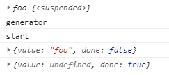
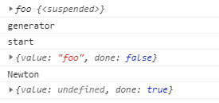
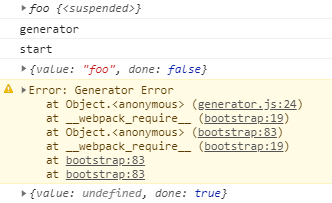

# Generator 异步方案

使用 Promise 去处理异步任务的串联执行会形成一个任务链条，形式如下：

```js
ajax('/api/url1')
  .then(value => ajax('/api/url2'))
  .then(value => ajax('/api/url3'))
  .then(value => ajax('/api/url4'))
  .catch(err => console.error(err))
```

但是这种写法仍然会有大量的回调函数，没办法达到传统同步代码的可读性：

```js
// 传统代码方式
try {
  const val1 = ajax('/api/url1')
  console.log(val1)
  const val2 = ajax('/api/url2')
  console.log(val2)
  const val3 = ajax('/api/url3')
  console.log(val3)
  const val4 = ajax('/api/url4')
  console.log(val4)
} catch (err) {
  console.error(err);
}

```

下面来看 2种更优的异步编程写法。

## ES 2015 提供的 Generator

### 生成器函数

*generator.js*

```js
// 生成器函数回顾 //
function * foo() {
  console.log('start')
}

// 生成器函数并不会立即执行
// 而是得到一个生成器对象
// 手动调用 next() 生成器函数体才会执行
const generator = foo()
console.log('generator')
generator.next()

```

结果：

```
generator
start
```

### yield 返回一个值

*generator.js*

```js
// 生成器函数回顾 //
function * foo() {
  console.log('start')
  // 使用 yield 关键词向外返回值
  // 暂定生成器
  yield 'foo'
}

const generator = foo()
console.log(generator)
console.log('generator')
const result = generator.next()
console.log(result)
console.log(generator.next())

```

 

### yield 的返回值

*generator.js*

```js
// 生成器函数回顾 //
function * foo() {
  console.log('start')
  // 使用 yield 关键词向外返回值
  // 暂定生成器
  const res = yield 'foo'
  console.log(res)
}

const generator = foo()
console.log(generator)
console.log('generator')
const result = generator.next('Darwin')
console.log(result)
// next() 传参可以作为 yield 的返回值
console.log(generator.next('Newton'))

```

 

### 生成器内部抛出异常

*generator.js*

```js
// 生成器函数回顾 //
function * foo() {
  console.log('start')

  try {
    // 使用 yield 关键词向外返回值
    // 暂定生成器
    const res = yield 'foo'
    console.log(res)  
  } catch (error) {
    console.warn(error)    
  }
}

const generator = foo()
console.log(generator)
console.log('generator')
const result = generator.next('Darwin')
console.log(result)
// 向生成器内部抛出异常
console.log(generator.throw(new Error('Generator Error')))

```

 

## Generator 函数异步方案

*generator-promise.js*

```js
// Generator 配合 Promise 的异步方案
function ajax(url) {
  return new Promise((resolve, reject) => {
    var xhr = new XMLHttpRequest()
    xhr.open('GET', url)
    xhr.responseType = 'json'
    xhr.onload = () => {
      if (xhr.status === 200) {
        resolve(xhr.response)
      } else {
        reject(new Error(xhr.statusText))
      }
    }
    xhr.send()
  })
}

function * main() {
  const users = yield ajax('/api/users.json')
  console.log(users)
}

const generator = main()
const result = generator.next()
result.value.then(data => {
  generator.next(data)
})
```

结果：

```
[
  {name: "zce", age: 24}
  {name: "alan", age: 25}
]
```

### 递归调用

写法一：*generator-promise.js*

```js
// Generator 配合 Promise 的异步方案
function ajax(url) {
  return new Promise((resolve, reject) => {
    var xhr = new XMLHttpRequest()
    xhr.open('GET', url)
    xhr.responseType = 'json'
    xhr.onload = () => {
      if (xhr.status === 200) {
        resolve(xhr.response)
      } else {
        reject(new Error(xhr.statusText))
      }
    }
    xhr.send()
  })
}

function * main() {
  const users = yield ajax('/api/users.json')
  console.log(users)
  
  const posts = yield ajax('/api/posts.json')
  console.log(posts)
}

function callMain(generator, data) {
  const result = generator.next(data)
  if (result.done) {
    return;
  }
  result.value.then(data => {
    callMain(generator, data)
  })
}

callMain(main())

/* const result = generator.next()
result.value.then(data => {
  const result2 = generator.next(data)
  result2.value.then(data => {
    generator.next(data)
  })
}) */
```

写法二：*generator-promise.js*

```js
function * main() {
  const users = yield ajax('/api/users.json')
  console.log(users)
  
  const posts = yield ajax('/api/posts.json')
  console.log(posts)
}

function handleResult(result) {
  if (result.done) return
  result.value.then(data => {
    handleResult(g.next(data))
  })
}

const g = main()
handleResult(g.next())
```

### 捕获异常

```js

function * main() {
  try {
    const users = yield ajax('/api/users.json')
    console.log(users)
    
    const posts = yield ajax('/api/posts.json')
    console.log(posts)
  
    const urls = yield ajax('/api/urls11.json')
    console.log(urls)  
  } catch (error) {
    console.log(error);
  }
}

function handleResult(result) {
  if (result.done) return
  result.value.then(data => {
    handleResult(g.next(data))
  }, error => {
    g.throw(error)
  })
}

const g = main()
handleResult(g.next())

```

### 生成器函数执行器CO

https://github.com/tj/co