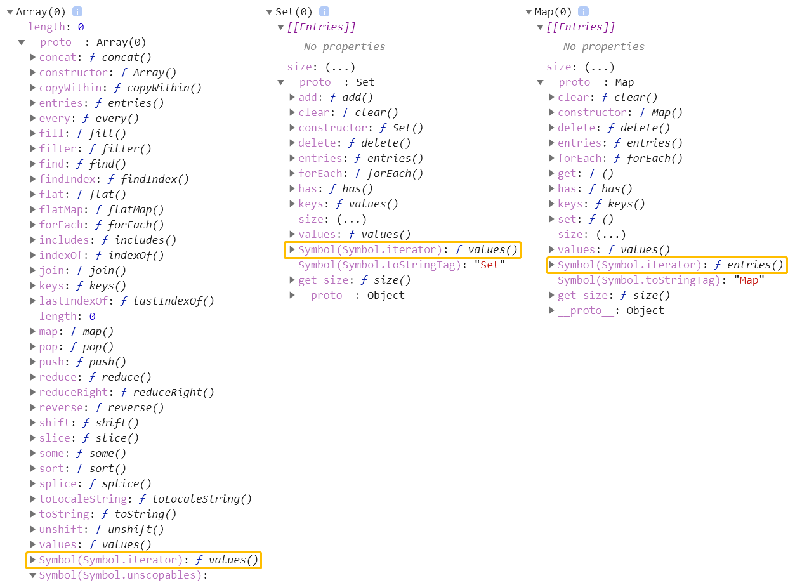
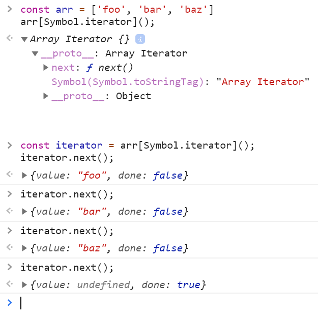

# for .. of

作为遍历所有数据结构的统一方式

```js
const arr = [100, 200, 300, 400]

for (const item of arr) {
  console.log(item)
  if (item > 100)
    break
}

// arr.forEach() // 不能终止遍历
// arr.some()
// arr.every()

const map = new Map()
map.set('foo', '123')
map.set('bar', '456')

for (const [key, value] of map) {
  console.log(key, value);
}

const obj = { foo: 123, bar: 456 }
for (const item of obj) {
  console.log(item)
}


// -> 100
// -> 200
// -> foo 123
// -> bar 456
// -> E:\Workstation\Webland\MyCourse\Kaiwulagou\lagou-frontend-2020\prepare.js:22
// -> for (const item of obj) {
// ->                    ^
// ->
// -> TypeError: obj is not iterable
```

# 可迭代的接口

> Iterable

for...of 循环是一种数据统一遍历方式，ES 中能够表示有结构的数据类型越来越多，为了给各种各样的数据结构提供统一遍历方式，ES 2015 提供了 Iterable 接口，实现 Iterable 接口 for...of 的前提。




所有可以被 for...of 循环遍历的数据类型，都必须实现 Iterable 接口，在内部必须挂载一个 iterator 方法，该方法返回带有 next() 方法的对象，通过调用 next() 方法达到遍历。

 

```js
// 迭代器（Iterable）

const set = new Set(['foo', 'bar', 'baz'])
const iterator = set[Symbol.iterator]()

console.log(iterator.next())
console.log(iterator.next())
console.log(iterator.next())
console.log(iterator.next())

// -> { value: 'foo', done: false }
// -> { value: 'bar', done: false }   
// -> { value: 'baz', done: false }   
// -> { value: undefined, done: true }
```

# 实现可迭代接口

> Iterable

```js
const obj = {

  store: ['foo', 'bar', 'baz'],

  [Symbol.iterator]() {
    let index = 0
    const self = this;

    return {// iterator
      next() {
        return {// IterationResult
          value: self.store[index],
          done: index++ >= self.store.length
        }
      }
    }
  }
}

for (const item of obj) {
  console.log(item)
}

// -> foo
// -> bar
// -> baz
```

# 迭代器模式

> Iterator

```js
// 迭代器设计模式
// 场景：协同开发一个任务清单应用

// My Code =========================

const todos = {
  life: ['eat', 'sleep', 'play'],
  learn: ['Java', 'C++', 'Python'],
  work: ['tea'],

  each(callback) {
    const all = [].concat(this.life, this.learn, this.work)
    for (const item of all) {
      callback(item)
    }
  },

  [Symbol.iterator]() {
    const all = [...this.life, ...this.learn, ...this.work];
    let index = 0;
    return {
      next() {
        return {
          value: all[index],
          done: index++ >= all.length
        }
      }
    }
  }
}

// Your Code =======================

todos.each((item) => {
  console.log(item)
})

console.log('\n')


for (const item of todos) {
  console.log(item)
}


// -> eat
// -> sleep
// -> play
// -> Java
// -> C++
// -> Python
// -> tea
// -> 
// -> eat
// -> sleep
// -> play
// -> Java
// -> C++
// -> Python
// -> tea
```

